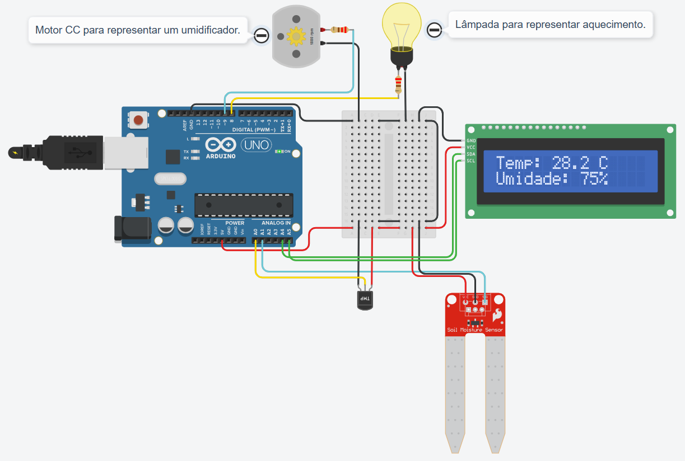

# 🌿 Sistema Automatizado de Estufa (Arduino & C++)

Este projeto final foi desenvolvido para o módulo de "Programação Aplicada em Hardware" da formação **C/C++ Developer** na [DIO.pro](https://www.dio.me/). O objetivo foi criar um sistema embarcado completo para controle climático, simulado via **Tinkercad**.

## 🎯 Objetivo do Projeto

Desenvolver uma solução autônoma para monitoramento e controle de temperatura e umidade em ambientes fechados (estufas/câmaras climáticas). O sistema processa sinais de sensores e atua sobre dispositivos de correção de forma inteligente.

---

## 🛠️ Arquitetura do Hardware

Para garantir a eficiência e a segurança dos componentes, o circuito foi projetado com as seguintes soluções:

* **Microcontrolador:** Arduino Uno R3.
* **Sensores:** * **TMP36:** Monitoramento de temperatura ambiente.
* **Sensor de Umidade (do solo):** Monitoramento dos níveis críticos de hidratação.
* **Interface (HMI):** Display LCD 16x2 com módulo **I2C (PCF8574)**, otimizando o uso de pinos do microcontrolador.
* **Atuadores de Potência:** * **Aquecedor (LED/Lâmpada):** Com resistor limitador de corrente para proteção do componente. Liga-se quando a temperatura medida for menor que 37°C.
* **Ventilador (Motor CC):** Com resistor limitador de corrente para proteção do componente. Liga-se quando a humidade relativa for menor que 80%.

---

## 🧠 Conceitos de Engenharia e Software Aplicados

### 1. Processamento de Sinais Analógicos

Implementação de cálculos matemáticos para converter tensões elétricas (0-5V) em unidades físicas reais (Celsius e Percentual), utilizando o mapeamento de bits do conversor ADC (10-bit).

### 2. Protocolos de Comunicação

Uso do protocolo **I2C (Inter-Integrated Circuit)** para comunicação com o display, exigindo a configuração correta de endereçamento e bibliotecas específicas para o chip PCF8574.

### 3. Eletrônica de Potência Fundamental

Aplicação de transistores como chaves eletrônicas para controle de motores, demonstrando o entendimento de que microcontroladores possuem limites de corrente que devem ser respeitados.

---

## 🕹️ Como Executar o Projeto

1. Acesse o ambiente do [Tinkercad](https://www.tinkercad.com/).
2. Monte o circuito utilizando os componentes citados ou importe o arquivo JSON do circuito.
3. No editor de código, certifique-se de incluir a biblioteca `Adafruit_LiquidCrystal.h` (ou similar compatível com PCF8574).
4. Compile e inicie a simulação.

---

## 📈 Conexão com Ciência de Dados e IoT

Este projeto representa a camada física de um ecossistema de dados. Como aspirante a Cientista de Dados, este trabalho demonstra o domínio sobre a **Coleta de Dados (Data Acquisition)**, garantindo que a informação que chega para análise seja precisa, tratada e livre de ruídos de hardware.